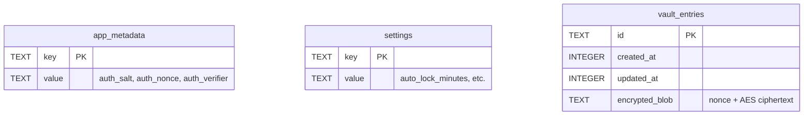

<div align="center">
  
  <h1 style="color: #c084fc;">CN Vault</h1>
  <p><strong>A premium, local-first, mathematically secure password manager.</strong></p>
  
  <p>
    
    
    
    
  </p>
  <p>
    
    
    
    
    
  </p>
</div>

---

## 📸 Screenshots

| Unlock Screen | Dashboard |
| :---: | :---: |
|  |  |

| Password Generator | Settings & App Tour |
| :---: | :---: |
|  |  |

---

## ✨ Features

### Security
* **Military-Grade Encryption**: AES-256-GCM authenticated encryption for all vault entries.
* **Hardened Key Derivation**: Argon2id (v0x13) protecting against GPU/ASIC brute-forcing.
* **Memory Zeroization**: Plaintext passwords and derived keys are mathematically wiped from RAM the millisecond they are no longer needed.
* **Auto-Lock**: Configurable inactivity timers to automatically lock your vault.
* **Anti-Brute Force**: Exponential backoff locking out rapid unlock attempts.

### Password Management
* **Smart Categories**: Sort by Logins, Email, API Keys, Recovery Codes, and Secure Notes.
* **Password Generator**: Highly customizable, entropy-scoring generator for uncrackable passwords.
* **Auto-Clearing Clipboard**: Passwords copied to the clipboard are destroyed after a configurable countdown.

### Vault Management & Organization
* **Real-time Search**: Instantaneous full-text search across all credentials and notes.
* **Interactive App Tour**: Built-in onboarding dynamically walks new users through every feature.
* **Network Awareness**: Live network status indicator ensuring you know when domain icons can be fetched.
* **Profile Customization**: Local avatars with built-in image cropping.

### Backup System
* **Encrypted Export**: Export your entire `.db` securely.
* **Integrity-Checked Import**: SQLite `PRAGMA integrity_check` validation prevents importing corrupted or malicious backup files.

---

## 🎯 Why CN Vault?

**1. Design Philosophy**  
Password managers shouldn't look like spreadsheets from 2005. CN Vault blends the aesthetic excellence of modern SaaS with the uncompromised security of an offline bunker. Our signature UI embraces a premium dark theme with deep indigo depths, striking cyan highlights, and a signature violet glow.

**2. Local-First & Offline-First Philosophy**  
Your passwords belong to you. Not to a cloud provider, not to a subscription service. CN Vault never sends your vault to the internet. Everything lives in a heavily encrypted SQLite file right on your hard drive. 

**3. Security Philosophy**  
We don't trust our own code. We employ "defense-in-depth." The database is encrypted. The memory is zeroized. The clipboard is wiped. The imports are verified. There is no telemetry, no analytics, and no backdoors.

---

## 🏗 Architecture Overview

```mermaid
graph TD
    User([User]) --> |Interacts| UI[React UI Layer]
    UI --> |State Management| App[Application Layer - Zustand]
    App --> |Tauri IPC| Tauri[Tauri Backend - Rust]
    
    subgraph Security Layer
        Tauri --> |Argon2id| Key[Key Derivation]
        Tauri --> |AES-256-GCM| Enc[Encryption Engine]
        Tauri --> |Zeroize| RAM[Memory Protection]
    end
    
    Security Layer --> |Encrypted Blob| DB[(SQLite Database)]
```

---

## 🛠 Technology Stack

| Technology | Purpose | Why It Was Chosen |
| :--- | :--- | :--- |
| **Rust** | Core Backend & Cryptography | Unmatched memory safety, C-like performance, and excellent cryptographic libraries. |
| **Tauri** | Application Framework | Produces incredibly tiny, lightning-fast native binaries without the massive RAM overhead of Electron. |
| **React** | UI Library | Component-driven architecture allows for a highly interactive, responsive frontend. |
| **Zustand** | State Management | Lighter and faster than Redux; perfect for managing live vault state and UI reactivity. |
| **SQLite** | Database | The most tested database in the world. Provides atomic, offline, single-file storage. |
| **TailwindCSS** | Styling | Rapid, highly-customizable design system enabling our "glassmorphism" aesthetic. |
| **Argon2id** | Key Derivation | The winner of the Password Hashing Competition; highly resistant to side-channel and GPU attacks. |
| **AES-256-GCM** | Encryption | Industry-standard authenticated encryption, preventing both reading and tampering of ciphertext. |

---

## 📂 Project Structure

```text
src-tauri/                 # Rust Backend (Tauri)
├── src/
│   ├── commands.rs        # IPC Handlers (Unlock, Save, Import)
│   ├── crypto.rs          # Argon2id & AES-256-GCM implementations
│   ├── database.rs        # SQLite schemas & PRAGMAs
│   ├── models.rs          # Rust Structs
│   └── lib.rs             # Tauri Entrypoint & Throttle logic
└── tauri.conf.json        # Tauri configuration

src/                       # Frontend (React)
├── components/            # Reusable UI (Layouts, Modals, Tour)
├── features/              # Feature slices (Auth, Entries, Settings)
├── lib/                   # Utility functions & Zod schemas
├── store/                 # Zustand global state (vaultStore.ts)
├── index.css              # Global styles (Tailwind + Glassmorphism)
└── App.tsx                # Main Routing & View Controller
```

---

## 🛡 Security Architecture

### Key Derivation & Encryption Flow
1. **Input**: User provides the Master Password.
2. **Salt**: A 16-byte CSPRNG salt is fetched from SQLite metadata.
3. **KDF**: Argon2id hashes the password + salt into a 32-byte `SecretKey`.
4. **Zeroize**: The plaintext password string is mathematically overwritten with zeroes in RAM.
5. **Encryption**: AES-256-GCM encrypts the JSON entry payload using the `SecretKey` and a fresh 12-byte nonce.
6. **Storage**: The nonce and ciphertext are concatenated and saved as hex to SQLite.

### Threat Model Mitigations
* **Cold Storage Attack (Stolen Laptop)**: The database is completely unreadable without the master password. Argon2id makes brute-forcing computationally infeasible.
* **RAM Dump Attack**: `ZeroizeOnDrop` guarantees that the `SecretKey` is destroyed the moment the vault locks. The frontend never holds the plaintext master password in global state.
* **Tampering Attack**: AES-GCM is an *authenticated* cipher. If a single bit of the database file is altered externally, decryption will fail cleanly, preventing chosen-ciphertext attacks.

---

## 💾 Database Design

The database is a local SQLite file (`vault.db`) running in WAL mode for maximum performance.


*Note: All sensitive data (passwords, usernames, notes, URLs) resides entirely inside the `encrypted_blob` column.*

---

## 🎨 Icon & UI System

### Domain Icons
When you save a login URL, CN Vault attempts to fetch the website's favicon.
* **Network Status**: Icons are only fetched when the app detects an active internet connection.
* **Offline Fallback**: If offline, the app seamlessly falls back to beautiful gradient initials.

### Responsive Design
* **Desktop**: Full sidebar, multi-pane layouts.
* **Tablet**: Collapsible sidebars, modal optimization.
* **Phone**: (Future Android Build) Bottom-navigation architecture, touch-friendly hitboxes.

---

## 🚀 Installation & Development

### Requirements
* Node.js (v18+)
* Rust (v1.77+)
* System dependencies for Tauri (e.g., `libwebkit2gtk-4.1-dev` on Linux)

### Setup
```bash
# Clone the repository
git clone https://github.com/marjuk06/cn-vault.git
cd cn-vault

# Install frontend dependencies
npm install

# Run in Development Mode
npm run tauri dev
```

### Production Build
```bash
# Build the highly optimized native binary
npm run tauri build
```
*The compiled binary will be located in `src-tauri/target/release/`.*

---

## ⚙️ Configuration

Security and Application options can be configured directly inside the app via the **Settings Panel**:
* **Auto-Lock Timer**: Default is 5 minutes.
* **Clipboard Clear Timer**: Default is 30 seconds.
* **Master Password**: Changeable at any time.

---

## 🗺 Roadmap

- [x] **V1: The Foundation**
  - Offline-first SQLite storage
  - Argon2id + AES-256-GCM Cryptography
  - Full React UI with App Tour
  - Password Generator
- [ ] **V2: Quality of Life**
  - Browser Extension integration (Autofill)
  - Biometric Unlock (TouchID / Windows Hello)
- [ ] **V3: Mobile**
  - Native Android app using Tauri Mobile
  - Local Wi-Fi Syncing between Desktop & Mobile

---

## 🤝 Contributing

We welcome contributions from the community!
1. **Code Style**: We strictly adhere to `rustfmt` for Rust and `eslint`/`prettier` for TypeScript.
2. **Pull Requests**: Ensure all tests pass (`cargo test`) before submitting.
3. **Architecture**: Do not introduce cloud dependencies or external network calls outside of the favicon fetcher.

---

## 🚨 Security Policy

Security is our absolute highest priority. 

If you discover a vulnerability, **DO NOT** open a public issue. 
Please report it securely via email to `security@cnvault.example.com`. We practice Responsible Disclosure and will address the issue immediately.

---

## ⚖️ License

This project is licensed under the **MIT License**. You are free to use, modify, and distribute the code as long as you provide attribution.

---

## 👏 Acknowledgements

* [Tauri](https://tauri.app/) - For making lightweight desktop apps possible.
* [RustCrypto](https://github.com/RustCrypto) - For peer-reviewed, state-of-the-art cryptographic implementations.
* [Lucide](https://lucide.dev/) - For beautiful iconography.
* [shadcn/ui](https://ui.shadcn.com/) - For aesthetic inspiration.
